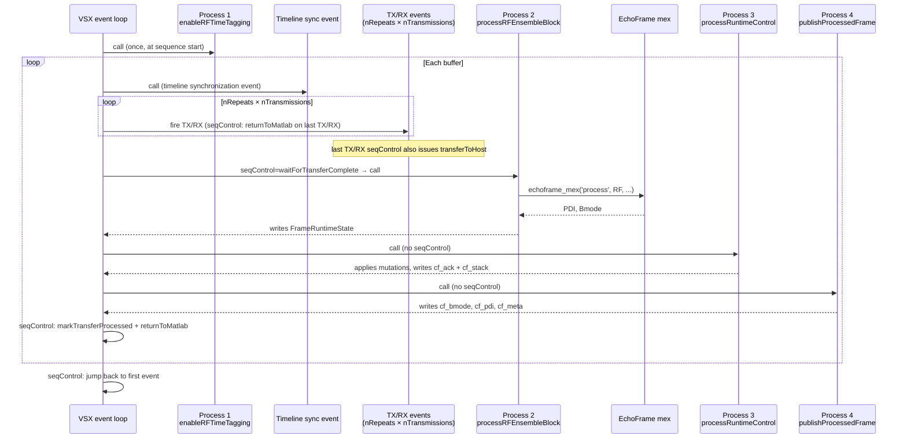

# Event Timeline

This page describes the Verasonics event loop structure used for power Doppler acquisition, including how process functions and sequence control commands are ordered within each buffer cycle.

## Process Function Assignments

Four external process functions are registered in every Effusive sequence via `effusive.sequences.getCommonProcessFunctions`:

| Index | Function | Role |
|-------|----------|------|
| 1 | `effusive.vantage.enableRFTimeTagging` | Enables hardware RF time tagging once at sequence start. |
| 2 | `effusive.rf.processRFEnsembleBlock` | Runs EchoFrame beamforming on the transferred RF buffer. |
| 3 | `effusive.control.processRuntimeControl` | Decodes napari commands and applies hardware/storage mutations. |
| 4 | `effusive.rf.publishProcessedFrame` | Writes display images and status to shared memory. |

## Per-Buffer Event Sequence

Each acquire/process cycle corresponds to one RF buffer and runs the following events in order.

## Event Details

### Sequence start: RF time tagging

The first event in the sequence calls `enableRFTimeTagging` (Process 1), which programs the Verasonics hardware to embed a hardware timestamp in the first two int16 words of each received RF ensemble. This runs once when VSX starts the sequence and is not repeated per buffer.

### Per-buffer: timeline synchronization

The first per-buffer event is a synchronization placeholder (no external process) that keeps trigger-out timing aligned with the sequence timeline.

### Per-buffer: TX/RX ensemble

`nRepeats × nTransmissions` back-to-back TX/RX events acquire one power Doppler ensemble. Each event uses `seqControl=2` (a `returnToMatlab` noop that keeps VSX responsive). The final TX/RX event additionally carries a `transferToHost` command, which initiates DMA transfer of the receive buffer to host memory.

### Per-buffer: RF processing (Process 2)

The beamforming event carries `seqControl=waitForTransferComplete`, so VSX stalls until the DMA transfer is complete before invoking `processRFEnsembleBlock`. This function:

1. Reads `svdUpdateFlag` and `updateCropping` from the base workspace to select the processing branch.
2. In normal operation calls `echoframe_mex('process', RF, storeEchoFrameOutput)` to produce `PDI` and `Bmode` arrays.
3. On SVD update calls `echoframe_mex('updatePDIthreshold&process', ...)` which also updates the clutter filter threshold.
4. On crop or experiment update calls `echoframe_mex('re-init storage', ...)` then `echoframe_mex('process', ...)`.
5. Writes results into `FrameRuntimeState` in the base workspace, including the raw `PDI`/`Bmode` arrays, a reference to the raw RF ensemble, the hardware ensemble timestamp, and timing bookkeeping fields.

The `storeEchoFrameOutput` flag controls whether EchoFrame writes data to disk. It is read at the top of Process 2 and reflects the value set during the **previous** frame by Process 3 (see [Runtime Control](runtime-control.md#save-state)).

### Per-buffer: Runtime control (Process 3)

`processRuntimeControl` runs immediately after Process 2 with no seqControl barrier. It reads the `cf_cmd` shared memory segment, decodes all command fields, and applies any changes whose request ID has advanced since the last call. Changes applied include freeze/unfreeze, voltage, TX/RX aperture, TGC control points, SVD threshold, crop ROI, z-stack start/abort/jog, and save configuration. For each applied command it writes the request ID back into `cf_ack`. See [Runtime Control](runtime-control.md) for full semantics.

The save-enable flag (`storeEchoFrameOutput`) is updated at the **end** of Process 3, so it takes effect in the next Process 2 EchoFrame call (one-frame delay).

### Per-buffer: Frame publication (Process 4)

`publishProcessedFrame` runs last in the buffer cycle. It skips silently if `FrameRuntimeState.frameReady` is false (which happens when the SVD-update branch ran in Process 2 and produced no display output). Otherwise it:

1. Writes the raw B-mode and PDI float32 arrays into `cf_bmode` and `cf_pdi` (napari log-compresses each to dB relative to its own per-frame peak on its decoupled polling tick).
2. If `publishRfSnapshot` was set by Process 3, writes a 16-byte header plus the raw RF slice into `cf_rf`.
3. Updates `cf_meta`: increments the frame counter, writes runtime flags (save active, freeze state), and writes the hardware ensemble timestamp.
4. Accumulates per-frame timing and prints a summary every 200 frames.

### Reset and jump

The final event in each buffer cycle carries `seqControl=[markTransferProcessed, returnToMatlab]`, which releases the receive buffer slot for reuse and yields control back to MATLAB. The last event of the outer loop is a jump back to the first event.

## FrameRuntimeState Inter-Callback Bus

Process 2, 3, and 4 communicate through a single base-workspace struct `FrameRuntimeState`. Process 2 populates it each frame; Process 3 may set `publishRfSnapshot` on it; Process 4 reads it for publication and resets fields it consumes.

| Field | Type | Written by | Read by |
|-------|------|-----------|---------|
| `frameReady` | logical | P2 | P4 |
| `PDI` | single \[nz, nx\] | P2 | P3 (z-stack), P4 (raw, log-compressed to dB by napari) |
| `Bmode` | single \[nz, nx\] | P2 | P3 (z-stack), P4 (raw, log-compressed to dB by napari) |
| `RF` | int16 \[raw ensemble\] | P2 | P4 (sliced into an RF snapshot only when `publishRfSnapshot` is true) |
| `ensemble_time_s` | double | P2 | P4 |
| `publishRfSnapshot` | logical | P3 | P4 |
| `t_frame_start_tic` | uint64 | P2 | P4 |
| `t_vsx_wait_s` | double | P2 | P4 |
| `t_last_publish_end_tic` | uint64 | P4 | P2 |
