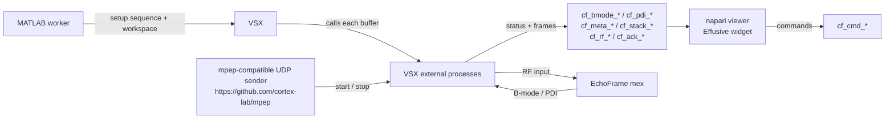
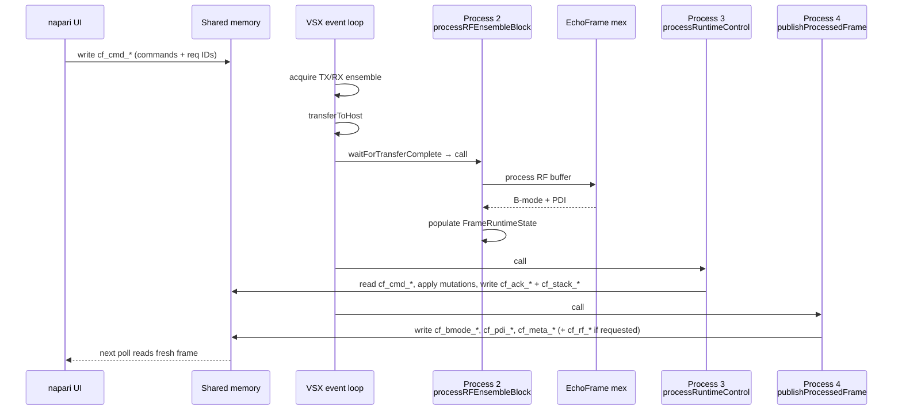

# Architecture Overview

This page describes how Effusive's Python, MATLAB, and Verasonics pieces fit together at runtime.

## Main Components

- `effusive` CLI starts napari and launches the MATLAB worker subprocess.
- The napari widget writes operator commands into a session-scoped shared-memory channel set and reads processed frame data back out.
- The MATLAB worker configures the Verasonics sequence and the VSX base workspace before calling `VSX`.
- VSX runs the acquisition/event loop and calls external Effusive process functions each buffer.
- EchoFrame performs beamforming and power Doppler processing inside `processRFEnsembleBlock`.

## Runtime Data Flow

## Per-Buffer Processing Shape

After each RF buffer transfer completes, VSX calls three external process functions in sequence.

The `*` suffix here means "one unique segment set per acquisition run". Python creates
fresh names before launching MATLAB and passes the resolved names into the worker.

## Ownership Boundaries

- Python owns napari presentation, operator input, worker lifecycle, and shared-memory polling.
- MATLAB owns Verasonics sequence configuration, process-function orchestration, and base-workspace runtime state.
- EchoFrame owns beamforming and Doppler processing internals.
- VSX owns event scheduling and process callback invocation.

## Further Reading

- [Event Timeline](event-timeline.md) — full per-buffer event sequence and process function assignments.
- [Shared Memory Protocol](shared-memory.md) — segment layouts, ownership, and request/ack protocol.
- [Runtime Control](runtime-control.md) — command semantics, save state machine, and z-stack control.
