# Runtime Control

`processRuntimeControl` (Process 3) decodes the `cf_cmd` shared memory segment every frame and applies any command whose request ID has advanced. This page describes what each command does and how the more complex subsystems — save state, crop, and z-stack — behave.

## Viewer log semantics

Python-side runtime logs use a fixed two-tag prefix style:

- `[HH:MM:SS.mmm] [viewer] ...` for napari/widget/runtime messages.
- `[HH:MM:SS.mmm] [worker] ...` for Python worker wrapper messages.
- `[HH:MM:SS.mmm] [matlab] ...` for forwarded MATLAB output (both app-authored and generic MATLAB output).

Message verbs are intentionally consistent:

- **requested**: user/UI requested a command.
- **applied/updated/enabled/disabled**: command state change accepted.
- **ignored**: valid message that is a no-op in current state.
- **rejected/error/failed**: command was not accepted or execution failed.

## Command Summary

| Command | cf_cmd fields | Effect |
|---------|--------------|--------|
| vsExit | `vsExit` | Stops VSX; aborts any active z-stack first |
| Freeze | `freeze`, `freeze_req_id` | Pauses/resumes acquisition in VSX via the Freeze button handle and synchronized base `freeze` latch |
| Voltage | `voltage_v`, `voltage_req_id` | Calls `setTpcProfileHighVoltage` to update transmit HV |
| TX aperture | `tx_aperture`, `tx_aperture_req_id` | Recalculates TX apodization, issues `TX` update command |
| RX aperture | `rx_aperture`, `rx_aperture_req_id` | Recalculates RX apodization, issues `Receive` update command |
| TGC | `tgc_point_1..8`, `tgc_req_id` | Updates `TGC.CntrlPts` and recomputes the TGC waveform, issues `TGC` update command |
| SVD threshold | `svd_threshold`, `svd_req_id` | Sets `svdThreshold` and arms `svdUpdateFlag`; Process 2 applies it next frame |
| Crop | `roi_top/bottom/left/right`, `crop_update_flag`, `crop_req_id` | Updates `ReconSpec.croppingROI`, arms `updateCropping`; Process 2 re-inits EchoFrame next frame |
| Crop reset | `crop_reset_flag`, `crop_req_id` | Resets ROI to full FOV, arms `updateCropping` |
| RF snapshot | `show_rf` | Rising edge sets `FrameRuntimeState.publishRfSnapshot`; Process 4 writes `cf_rf` that frame |
| Save config | `save_to_disk`, `save_rf/bf/pdi/rf_time_tag`, `save_req_id` | Reconfigures EchoFrame storage; see Save State below |
| Z-stack start | `stack_start_flag`, `stack_*`, `stack_req_id` | Starts the z-stack state machine |
| Z-stack abort | `stack_abort_flag`, `stack_req_id` | Aborts the active z-stack |
| Z-stack jog | `stack_jog_um` | One-shot relative motor move (µm); only when no stack is active |

### Freeze latch invariant

CortexFrame uses VSX's built-in freeze loop. Entering freeze sets the base-workspace `freeze` variable, which makes `VSX.m` issue `stopSequence`, and also sets the hidden `Freeze` togglebutton that VSX later waits on before issuing `startSequence`. Resuming clears both latches together. Any MATLAB-side freeze transition must keep these two states synchronized exactly like a manual pause.

## Live vs startup-only controls

The napari widget exposes both runtime controls and startup-only sequence controls.

- **Live (applied immediately while running):** freeze, record/save toggle, save data-type flags (BF/PDI/RF/time tag), voltage, TX aperture, RX aperture, TGC, SVD threshold, crop, RF snapshot, and z-stack commands.
- **Startup-only (apply on next run start):** transmit frequency, pulse length, transmissions per ensemble, ensemble size (`nRepeats`), opening angle, and imaging depth.

Startup-only controls are sent to MATLAB through the worker launch config (`cortexframe.napari.setup`) rather than `cf_cmd`, so changing them mid-run updates UI/config state but does not reprogram the active VSX sequence.

## Save State

Whether EchoFrame writes data to disk is controlled by a combination of the napari save button, the type of data to save (BF, PDI, RF, timestamps), and optionally by [mpep](https://github.com/cortex-lab/mpep)-compatible UDP messages.

### Manual control

The effective save flag is `save_to_disk` from `cf_cmd`. The four save-type flags (`save_bf`, `save_pdi`, `save_rf`, `save_rf_time_tag`) select which outputs EchoFrame writes.

When `save_to_disk` and at least one type flag are active, `processRuntimeControl` calls EchoFrame's `init_storage` via `re-init storage` to create a new experiment folder and configure file writers. When saving is turned off it calls `re-init storage` with inactive specs to flush and close writers. This re-init takes effect on the next `echoframe_mex('process', ...)` call in Process 2.

### UDP control

`BlockStart` is the trigger that can start recording: on the first `BlockStart`, Python validates metadata/collision state, writes `save_to_disk=1`, waits for MATLAB to acknowledge `save_req_id`, and only then echoes `BlockStart`. Later `BlockStart` packets are echoed immediately. `ExpEnd` or `ExpInterrupt` sends `save_to_disk=0` and clears UDP session state.

UDP-triggered recording uses the same save command path as manual recording; the only UDP-specific behavior is that metadata is applied from the `BlockStart` payload before the first start command.

### One-frame delay

`storeEchoFrameOutput` (the flag passed to `echoframe_mex`) is read at the **top** of Process 2 and written back with the new value at the **bottom** of Process 3. This means the change takes effect in the next frame's Process 2 call, not the current one.

### Trigger output

When saving transitions from off to on, `cortexframe.sequences.setTriggerOutEnabled(true)` arms the Verasonics digital trigger output line. This line pulses at the top of every buffer cycle (timeline sync event) while saving is active, providing a frame-synchronised signal to external acquisition systems.

## Hardware Updates

TX aperture, RX aperture, and TGC updates modify Verasonics workspace structs and take effect immediately via `addUpdateAndRunCommand`, which issues a VSX `run` command without restarting the sequence.

- **TX aperture**: `cortexframe.sequences.calculateApertureApodization` (taper `0.1`) computes a Tukey-windowed apodization scaled to the requested percentage of the active elements. Applied to all entries in the `TX` array.
- **RX aperture**: `cortexframe.sequences.calculateApertureApodization` (taper `0.2`) does the same for the `Receive` array.
- **TGC**: Sets `TGC(1).CntrlPts` and recomputes `TGC(1).Waveform` via `computeTGCWaveform`. Eight control points are applied uniformly across the depth range.
- **Voltage**: Calls `setTpcProfileHighVoltage(voltage_v, 1)`, which updates TPC profile 1. Takes effect on the next TX cycle.

## Crop and SVD Updates

Crop and SVD changes require EchoFrame to reinitialise its internal buffers. Rather than calling directly into EchoFrame from Process 3, `processRuntimeControl` arms flag variables that Process 2 checks at the top of its next call:

- **SVD**: sets `svdThreshold` and `svdUpdateFlag = 1`. Process 2 calls `echoframe_mex('updatePDIthreshold&process', RF, ...)` to update the SVD filter while processing the current RF buffer, but this branch does not repopulate `FrameRuntimeState`, so `publishProcessedFrame` skips that frame.
- **Crop**: sets `ReconSpec.croppingROI`, `ReconSpec.cropBF`, `PDISpec.cropPDI`, and `updateCropping = 1`. Process 2 calls `echoframe_mex('re-init storage', ...)` (preserving current storage config) then `echoframe_mex('process', ...)` with the new ROI, repopulates `FrameRuntimeState`, and publishes the cropped frame normally.

## Z-Stack State Machine

The z-stack state machine runs inside `processRuntimeControl` on frames where `FrameRuntimeState.frameReady` is true. State is held in a persistent `zStackState` struct and reported to Python via `cf_stack` after every transition.

```mermaid
stateDiagram-v2
    [*] --> IDLE
    IDLE --> INITIALIZING : stack_start_flag\n(ownership=manual)
    INITIALIZING --> MOVING_TO_SLICE : motor backend ready
    MOVING_TO_SLICE --> SETTLING : target reached
    SETTLING --> ACCUMULATING : settle delay elapsed
    ACCUMULATING --> ACCUMULATING : frame collected\n(framesInSlice < npdiPerSlice)
    ACCUMULATING --> FINALIZING_SLICE : npdiPerSlice frames collected
    FINALIZING_SLICE --> MOVING_TO_SLICE : more slices remain
    FINALIZING_SLICE --> COMPLETING : last slice done
    COMPLETING --> IDLE : NIfTI files exported
    ACCUMULATING --> ABORTING : stack_abort_flag or vsExit
    MOVING_TO_SLICE --> ABORTING : stack_abort_flag or vsExit
    SETTLING --> ABORTING : stack_abort_flag or vsExit
    ABORTING --> IDLE : motor stopped
    MOVING_TO_SLICE --> ERROR : motor exception
    ACCUMULATING --> ERROR : processing exception
    ERROR --> IDLE : (reported; manual reset required)
```

### Start conditions

A start request is accepted only when `experimentControlOwner == 'manual'` (i.e., no other subsystem owns the motor), the step size is non-zero, the slice count is positive, and frames-per-slice is positive. On accept, ownership changes to `'zstack'` and the motor backend is created or reused.

### Frame accumulation

Each frame where `ACCUMULATING` is active increments `framesInSlice` and stores the PDI and B-mode arrays into pre-allocated `sliceAccumulator` and `bmodeAccumulator` buffers. When `framesInSlice == npdiPerSlice`, the mean across the accumulator depth dimension is stored into the corresponding slice of `stackVolume` and `bmodeVolume`.

### Completion and export

After the last slice is finalised, `cortexframe.util.exportZStack` writes two NIfTI files (PDI volume and B-mode volume) and a JSON metadata sidecar to the current session storage path. The MATLAB state machine leaves the terminal `COMPLETING` status latched until the next stack start so Python can observe successful completion, hold the last stack preview, and issue the standard pause path in the UI. Export paths are logged via `cortexframe.util.logMessage` and reported in the napari console.

### Jog

When no stack is active and `stack_jog_um` is non-zero, the motor moves by that relative offset. This provides manual position control from the napari stack panel without starting a full acquisition.
